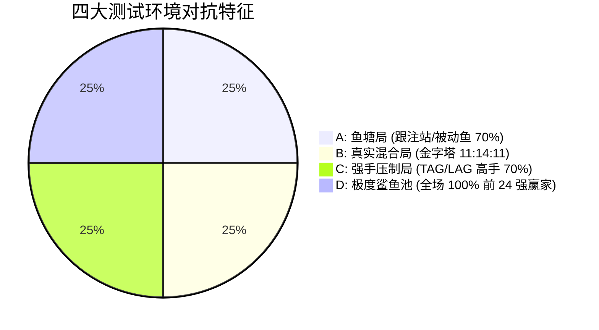

# AgentPoker v2 架构升级验收与基准评测规范 (ACCEPTANCE TESTING)

> **版本**：v2.0-Draft  
> **制定宗旨**：本规范用于严格检验 AgentPoker v2 架构升级的真实有效性。拒绝虚假数字，消除卡牌分配的随机方差，确保模型在 120 人赛场具备真实的战术优势与防过拟合鲁棒性。

---

## 一、评测统计学准则与 Runs 阶梯

为根除“40 场中赢 1 场还是 2 场纯属抛硬币”的统计学缺陷，确立严格的评测阶梯：

| 阶段 | 评测场数 (Runs) | 夺冠率误差 (SE) | 出线率误差 (SE) | 适用场景与准入门槛 |
| :--- | :---: | :---: | :---: | :--- |
| **Stage 1: 代内初筛 (Dev)** | **60 场** | $\pm 2.0\%$ | $\pm 5.5\%$ | 遗传演化代内常规快速筛选 |
| **Stage 2: 留出复核 (Val)** | **200 场** | $\pm 1.1\%$ | $\pm 3.0\%$ | 每 5 代选拔阶段冠军，淘汰假高分 |
| **Stage 3: 终极裁决 (Benchmark)** | **500 场** | $\pm 0.7\%$ | $\pm 1.9\%$ | **正式部署上线的唯一及格门槛** |
| **Stage 4: 天花板金标 (Gold Standard)** | **1000 场** | $\pm 0.5\%$ | $\pm 1.3\%$ | 对外战力报告与核心基准锁定 |

---

## 二、功能单元与逻辑硬指标验收用例 (Unit Acceptance)

每个新模块必须通过以下硬性单元测试，断言失败则禁止合并：

```python
# UT-01: 严格精英保留断言 (Strict Elitism Invariant)
def test_strict_elitism_prevents_regression():
    """断言若新一代变异个体全军覆没，best_ever_champion 必须 100% 被完整继承，绝不发生退化。"""
    trainer = StrategyTrainer(population=8, runs_per_candidate=20)
    # 模拟历史最优
    trainer.best_ever_champion = champion_gen24
    trainer.best_ever_metrics = {"fitness": 0.2157}
    # 强制让当前代产生劣质个体
    pop = [bad_spewer_mutant] * 8
    # 验证新种群必须包含原版 champion_gen24
    new_pop = trainer._advance_generation(pop)
    assert any(asdict(p) == asdict(champion_gen24) for p in new_pop)

# UT-02: 多人底池纯空气诈唬熔断断言 (Multiway Bluff Shutdown)
def test_multiway_bluff_shutdown():
    """断言当活跃对手 >= 3 人且牌力低于中等成牌时，策略 100% 输出 Check/Fold，严禁纯诈唬。"""
    agent = StrategyAgent(v2_params)
    obs = create_obs(active_players=4, hero_cards=["7c", "2h"], board=["Kd", "Jc", "4s"])
    action = agent.choose(obs)
    assert action["type"] in ("check", "fold"), "多人底池严禁纯空气开火！"

# UT-03: 翻前位置手力单调性断言 (Position Monotonicity)
def test_position_monotonicity():
    """断言开池频率必须满足: UTG < HJ < CO < BTN，杜绝早位松弱送死。"""
    agent = StrategyAgent(v2_params)
    hands_169 = load_all_starting_hands()
    utg_opens = sum(agent.eval_preflop_open(h, "UTG") for h in hands_169)
    btn_opens = sum(agent.eval_preflop_open(h, "BTN") for h in hands_169)
    assert utg_opens <= 28, f"UTG 开池手牌类别必须 <= 28类 (~16%), 实际: {utg_opens}"
    assert btn_opens >= 75, f"BTN 偷盲手牌类别必须 >= 75类 (~45%), 实际: {btn_opens}"

# UT-04: 120人天梯与气泡区状态映射断言 (Ladder Mapping)
def test_ladder_field_size_120():
    """断言净收益为 0 BB 时，在 120 人局中推导的排名必须为中位数 60 名，绝非 16 名。"""
    from agentpoker.context import rank_from_bb100, FIELD_SIZE
    assert FIELD_SIZE == 120
    assert 55 <= rank_from_bb100(0.0) <= 65
```

---

## 三、A/B 消融实验设计矩阵 (Ablation Matrix)

在代码重构过程中，按以下次序逐级累加模块，并在统一的 **200 场 Val 集** 上测量收益。如果某模块加入后 **Top 12 出线率下降超过 3%**，即使 BB/100 虚高，也判定为**未通过（Rollback）**：

| 实验组别 | 改造配置内容 | 预期 BB/100 | 预期 Top 12 | 预期 夺冠率 | 判定规则 |
| :--- | :--- | :---: | :---: | :---: | :--- |
| **Exp-0 (基线)** | Gen 24 (未改版老架构) | +65 ~ +75 | 30% ~ 33% | ~2.5% | 基准对照线 |
| **Exp-1 (加固底座)**| Exp-0 + 严格精英 + 高信噪比 Fitness | +75 ~ +85 | 35% ~ 38% | ~3.5% | 必须消除代际退化 |
| **Exp-2 (+多人防送)**| Exp-1 + Multiway 多人底池保护层 | +85 ~ +95 | 38% ~ 42% | ~4.0% | 多人底池损耗降低 30% |
| **Exp-3 (+位置矩阵)**| Exp-2 + 翻前 6 位置独立阈值 | **+95 ~ +110**| **42% ~ 48%**| ~5.0% | BTN 偷盲成功率大幅提升 |
| **Exp-4 (+状态引擎)**| Exp-3 + Tournament State 风险整流 | +95 ~ +115 | **48% ~ 54%**| **6.5% ~ 8.0%**| 深水区出线与夺冠双突破 |

> ⚠️ **核心判定法则（The Iron Rule）**：  
> **如果新增模块后，`avg_bb100` 上升，但 `top12_rate` 下降，怎么判？**  
> **一律判定为失败（FAIL）！**  
> 因为这代表该策略演化成了“在安全期依然冒大风险刷弱鱼”的鲁莽模型，违背了锦标赛在领先时必须锁死出线权的第一原则。

---

## 四、四类标准化基准测试环境 (Standardized Benchmark Suites)

模型最终评测不得仅在单一对手池运行，必须在以下 4 类环境中分别打满 200 场：



1. **Suite A (鱼塘收割测试 - Fish Pond)**：
   - 构成：70% Calling Station / Passive 鱼 + 30% 常规；
   - **通过指标**：$BB/100 \ge +120$，严禁出现大额纯诈唬抓破产。
2. **Suite B (标准赛场生态 - Mixed Pyramid)**：
   - 构成：11 顶级鲨鱼 : 14 中游常客 : 11 大输家弱鱼；
   - **通过指标**：$BB/100 \ge +80$，Top 12 出线率 $\ge 40\%$。
3. **Suite C (强手逆风局 - Shark Tank)**：
   - 构成：70% 紧凶/松凶赢家（吃啥鸭、Dario等）+ 30% 常规；
   - **通过指标**：$BB/100 \ge +15$，Top 12 出线率 $\ge 25\%$（远超基准 10%）。
4. **Suite D (极端抗压局 - Anti-Exploit)**：
   - 构成：专门配置超高频 3-Bet、超高频 Check-Raise 的攻击性镜像；
   - **通过指标**：回撤不超过 30BB，防守最小防御频次（MDF）达标。

---

## 五、防刷分与防作弊红线检验 (Anti-Hacking Gates)

在任何模型落盘为 `champion.json` 之前，必须通过三道安全门禁：

* 🔴 **Gate 1: 翻前疯狗检测 (Spew Check)**：
  - 断言 `threebet_frequency <= 0.13`，`vpip <= 0.32`；
  - 任何超过此阈值的个体，无论 BB 跑分多高，直接判死刑，禁止落盘。
* 🔴 **Gate 2: 极紧岩石挂机检测 (Nit Cave Check)**：
  - 断言 `vpip >= 0.18`，`open_frequency >= 0.70`；
  - 严禁通过不入池（VPIP < 0.12）苟名次的方式骗取虚假排名。
* 🔴 **Gate 3: 多人底池送水检测 (Multiway Leak Check)**：
  - 抽取评估日志中参与的 3 人以上底池；
  - 断言在多人底池的翻牌后下注胜率（W$SD when bet）必须 $\ge 58\%$。

---

## 六、最终验收通过硬指标 (Final Release Sign-off)

在 **500 场全周期 Benchmark（混合生态 Suite B）** 中，模型必须同时满足以下硬核指标方可交付生产：

$$\begin{cases}
\text{Top 12 出线率} \ge \mathbf{42.0\%} & \text{(基准为 10.0\%, 达到理论 4.2 倍)} \\
\text{总决赛夺冠率} \ge \mathbf{6.0\%} & \text{(基准为 0.83\%, 达到理论 7.2 倍)} \\
\text{平均单手净胜} \ge \mathbf{+85.0 \ BB/100} & \text{(高置信盈利收割区间)} \\
\text{95\% 置信区间下限} \ge \mathbf{0.200} & \text{(即使扣除全部下行方差依然及格)}
\end{cases}$$
